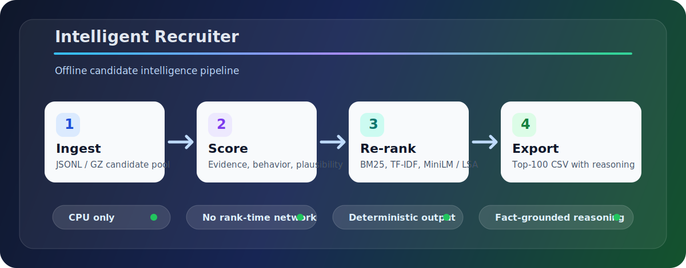
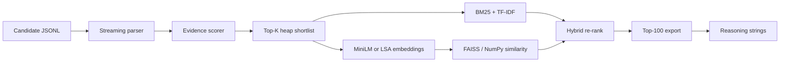

<h1 align="center">Intelligent Recruiter</h1>

<p align="center">
  <strong>Intelligent and smart offline candidate ranking system
</strong><br>
  Stream a large candidate pool, rank the strongest matches, and export fact-grounded recommendations in minutes.
</p>

<p align="center">
  
  
  
  
  
</p>

<p align="center">
  
</p>

## Product Snapshot

Intelligent Recruiter is a working prototype for recruiter-facing candidate discovery. It turns raw candidate profiles into a ranked top-100 export with scores and concise, profile-grounded reasoning for every selected candidate.

The core design principle is simple: **trust demonstrated career evidence over keyword claims.** The engine reads narrative work history, role titles, experience shape, availability signals, and profile plausibility before applying lexical and dense re-ranking to the strongest shortlist.

| Capability | What it delivers |
|---|---|
| Large-pool ranking | Streams `candidates.jsonl` without loading the full pool into memory |
| Evidence scoring | Rewards career-history proof of retrieval, ranking, evaluation, production ML, and domain fit |
| Trap resistance | Downranks keyword stuffing, impossible profile timelines, research-only paths, and role mismatch |
| Hybrid re-rank | Blends BM25, TF-IDF, optional MiniLM embeddings, and FAISS/NumPy vector search |
| Recruiter output | Exports `candidate_id,rank,score,reasoning` with deterministic ordering |
| Demo surface | Streamlit dashboard for sample uploads, ranked table review, risk flags, and CSV export |

## Single Command Export

From the repository root:

```bash
python rank.py --candidates ./candidates.jsonl --out ./submission/intelligent_recruiter.csv
```

The command accepts `.jsonl`, `.jsonl.gz`, or JSON-array sample files. The default export contains exactly 100 ranked candidates with:

```text
candidate_id,rank,score,reasoning
```

Useful options:

```bash
python rank.py --candidates ./candidates.jsonl --out ./ranked.csv --top 100
python rank.py --candidates ./candidates.jsonl --out ./ranked.csv --shortlist 1500
python rank.py --candidates ./candidates.jsonl --out ./ranked.csv --embedding-backend none
python rank.py --candidates ./candidates.jsonl --out ./ranked.csv --embedding-backend lsa
python rank.py --candidates ./candidates.jsonl --out ./ranked.csv --embedding-backend minilm
```

## Quick Start

```bash
git clone https://github.com/gkmraju/Intelligent-Recruiter.git
cd Intelligent-Recruiter
python -m venv .venv
```

Windows PowerShell:

```powershell
.\.venv\Scripts\Activate.ps1
pip install -r requirements.txt
python rank.py --candidates .\candidates.jsonl --out .\submission\intelligent_recruiter.csv
```

macOS/Linux:

```bash
source .venv/bin/activate
pip install -r requirements.txt
python rank.py --candidates ./candidates.jsonl --out ./submission/intelligent_recruiter.csv
```

Smoke test on the bundled sample:

```bash
python rank.py --candidates ./data/sample/ranking_sample_candidates.json --out ./submission/sample.csv --top 20
```

## Validation

Run the local validator before publishing an export:

```bash
python validate_submission.py ./submission/intelligent_recruiter.csv
```

Expected result:

```text
Submission is valid.
```

The validator checks UTF-8 CSV format, exact columns, 100 data rows, unique ranks 1-100, unique candidate IDs, valid `CAND_XXXXXXX` IDs, non-increasing scores, and deterministic tie ordering.

## How Ranking Works



### 1. Evidence Score

The first pass scans every candidate once and evaluates only cheap, deterministic signals:

- must-have concept evidence in summaries, titles, and career descriptions
- shipped retrieval, vector search, ranking, evaluation, and production ML signals
- experience band fit and title seniority
- preferred location and relocation signals
- behavioral availability such as activity recency, response rate, open-to-work, interview completion, notice period, and verification

This pass keeps only the strongest candidates in a fixed-size heap, so memory stays stable even on large pools.

### 2. Plausibility Filter

Profiles with impossible or suspicious timelines are forced to score zero before final ranking. Examples include skill durations longer than the entire career, multiple expert skills with no usage duration, career months inconsistent with claimed experience, future start dates, and single roles longer than the stated career.

### 3. Hybrid Precision Layer

The shortlist is re-ranked using:

- **BM25 Okapi** for saturated, length-normalized term relevance
- **TF-IDF 1-2 grams** for phrase matches such as `hybrid search` and `learning to rank`
- **MiniLM embeddings** when the local model is available
- **LSA fallback** when MiniLM is absent
- **FAISS** for exact inner-product search, with a NumPy fallback if FAISS is unavailable

The dense layer is optional. To enable the local MiniLM backend once:

```bash
python scripts/download_model.py
```

After download, ranking loads the model from `./models/` without network access.

## Reasoning Quality

Each exported row includes a 1-2 sentence explanation built only from extracted profile facts. The generator references details such as title, years of experience, evidenced technical areas, response rate, notice period, location fit, and visible concerns. It is deterministic, varied by candidate, and calibrated to rank position so a top-ranked profile sounds stronger than a borderline profile.

## Performance

| Dimension | Current behavior |
|---|---|
| Full pool size | 100,000 candidates |
| Runtime target | Under 5 minutes wall clock |
| Observed local runtime | About 65-70 seconds on laptop CPU |
| Memory profile | Under 2 GB in normal runs |
| Compute | CPU only |
| Rank-time network | None |
| Intermediate storage | No large generated index required |

## Streamlit App

Launch the recruiter dashboard:

```bash
streamlit run app/streamlit_app.py
```

The app supports:

- bundled sample data
- JSON/JSONL upload for small candidate samples
- main data file ranking from the project root
- progress visualization across scan, shortlist, re-rank, and export stages
- ranked table with risk flags and reasoning
- CSV download for review

Docker demo option:

```bash
docker build -t intelligent-recruiter .
docker run --rm -p 8501:8501 intelligent-recruiter
```

Then open `http://localhost:8501` and use the bundled sample data or upload a small JSON/JSONL candidate file.

## Repository Map

```text
Intelligent-Recruiter/
|-- rank.py                         # CLI export entry point
|-- validate_submission.py           # CSV validation utility
|-- Dockerfile                       # Self-contained dashboard runner
|-- app/
|   `-- streamlit_app.py             # Recruiter dashboard prototype
|-- scripts/
|   |-- download_model.py            # Optional local MiniLM download
|   `-- generate_shortlist.py        # Small-sample export helper
|-- src/intelligent_recruiter/
|   |-- job_intelligence/
|   |   `-- jd_profile.py            # Role concept profile and query text
|   `-- ranking_engine/
|       |-- features.py              # Evidence, behavior, plausibility checks
|       |-- scorer_v2.py             # Stage-1 scoring and penalties
|       |-- pipeline_v2.py           # Streaming pipeline and CSV writer
|       |-- embedder.py              # MiniLM / LSA semantic layer
|       |-- vector_store.py          # FAISS with NumPy fallback
|       `-- reasoning.py             # Fact-grounded explanation builder
|-- data/
|   |-- contracts/                   # Stable handoff schemas
|   `-- sample/                      # Demo-sized candidate fixtures
|-- docs/                            # Architecture and workflow notes
|-- submission/                      # Generated CSV exports
|-- tests/                           # Unit and integration tests
|-- requirements.txt
`-- submission_metadata.yaml
```

## Quality Gates

Run the core checks before pushing:

```bash
python -m unittest discover -s tests -v
python rank.py --candidates ./data/sample/ranking_sample_candidates.json --out ./submission/sample.csv --top 20 --embedding-backend none
python validate_submission.py ./submission/intelligent_recruiter.csv
```

The test suite covers strong-candidate scoring, keyword-stuffer penalties, plausibility filtering, behavioral downweighting, consulting-only penalties, reasoning specificity, embedding fallback behavior, LSA reuse, and FAISS search correctness.

## Release Checklist

- `requirements.txt` installs cleanly in a fresh virtual environment
- `rank.py` produces the top-100 CSV from the main candidate file
- validation passes on the generated CSV
- Streamlit app runs on the bundled sample
- `submission_metadata.yaml` contains real project, contact, demo, and compute details
- large local files remain excluded by `.gitignore`
- no API keys, `.env` files, virtual environments, or local model folders are tracked

## License

MIT. See [LICENSE](LICENSE).
